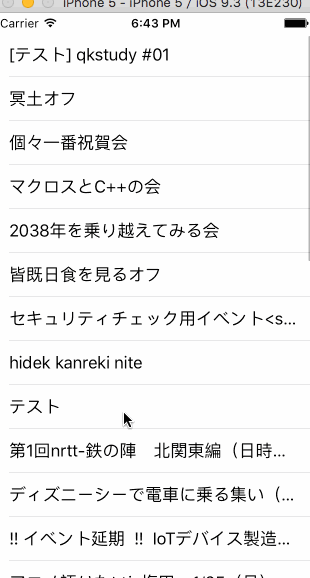

# RxSwiftSample

## Description
This repository is to lecture MVVM based Reactive Programming to Recruit Sumai Company Ltd (RSC).  
Common language in RSC is Japanese, so the comments in this project are also Japanese.  
I've explained what I did with this repository in [RSC's blog](https://tech.recruit-sumai.co.jp/rxswift-mvvm/), though it's Japanese.

#### *DEMO*



## Requirement

- Xcode 7.x


## Usuage

Install libraries.
```
carthage update --platform iOS
```
